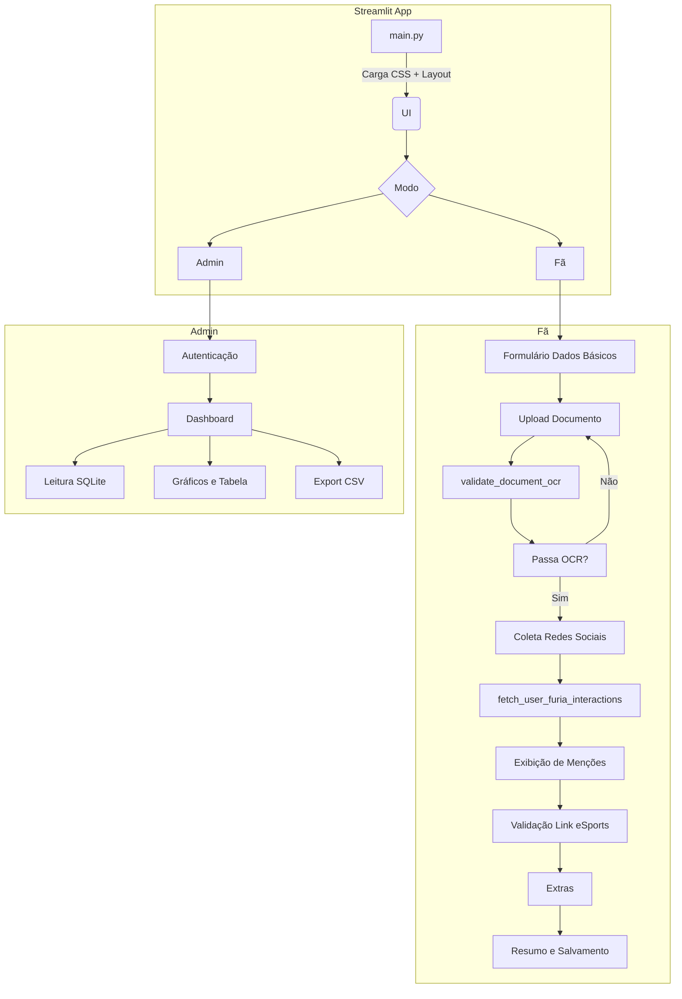

# Know Your FURIA Fan


Aplicativo web em Streamlit para registrar e validar dados de fãs da FURIA Esports, fornecendo um passo a passo (wizard) para coleta de informações, validações via OCR e integração com redes sociais e links de eSports.

---

## 📋 Funcionalidades

* **Modo Fã**: Coleta dados básicos, upload de documento com validação OCR, buscas e menções no Twitter, validação de link de perfil em sites de eSports, extras opcionais e resumo final.
* **Modo Admin**: Acesso ao dashboard com métricas de fãs cadastrados, distribuição de interesses, anos de fã, visualização de atividades, tabela de dados e exportação CSV.
* Cache interno em SQLite para reduzir chamadas à API do Twitter.
* Suporte a fallback via `snscrape` caso o acesso à API do Twitter seja limitado.

---

## 🏁 Instalação

1. Clone o repositório:

   ```bash
   git clone https://your-repo-url/knowyourfan.git
   cd knowyourfan
   ```
2. Crie e ative um ambiente virtual:

   ```bash
   python -m venv .venv
   source .venv/bin/activate  # Linux/macOS
   .\.venv\Scripts\activate  # Windows
   ```
3. Instale as dependências:

   ```bash
   pip install -r requirements.txt
   ```

---

## ⚙️ Configuração de Ambiente

Crie um arquivo `.env` na raiz com as variáveis abaixo (exemplo em `.env.example`):

```dotenv
TWITTER_BEARER_TOKEN=your_bearer_token
TW_API_KEY=...
TW_API_SECRET=...
TW_TOKEN=...
TW_TOKEN_SECRET=...
OPENAI_KEY=...
ADMIN_PASSWORD=admin123
```

* **ADMIN\_PASSWORD**: senha de acesso ao modo Admin.

---

## 🚀 Executando a Aplicação

```bash
streamlit run main.py
```

A aplicação estará disponível em `http://localhost:8501`.

---

## 🗄 Banco de Dados

* Utiliza SQLite (`knowyourfan.db`) criado automaticamente.
* Tabelas:

  * `tweets_cache`: cache de tweets (id, texto, autor, timestamps).
  * `fans` (criada no modo Admin): armazena perfis cadastrados.

---

## 🔍 Diagrama de Arquitetura



---

## 📜 Licença

MIT © Sua Organização
